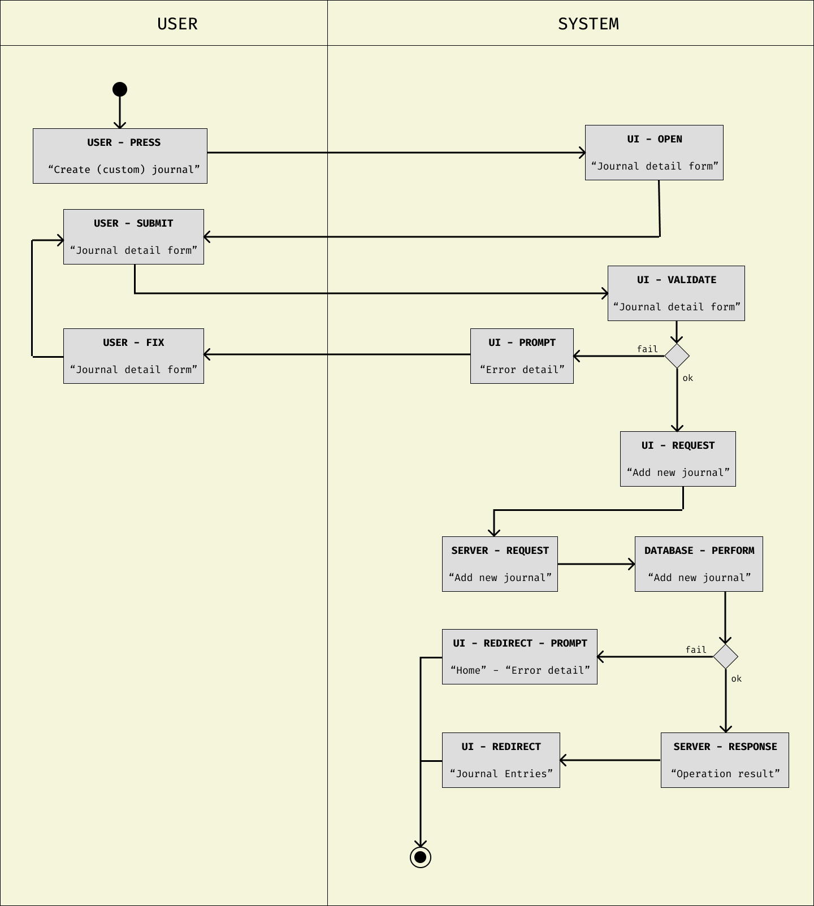
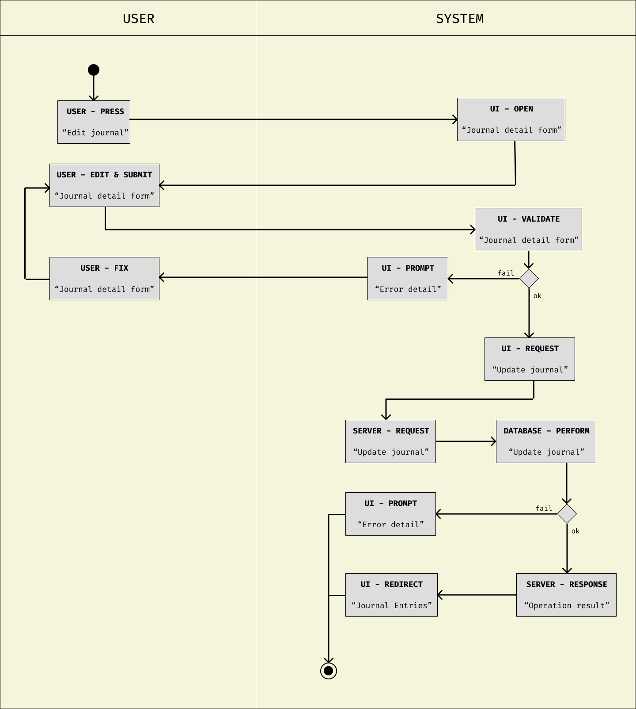
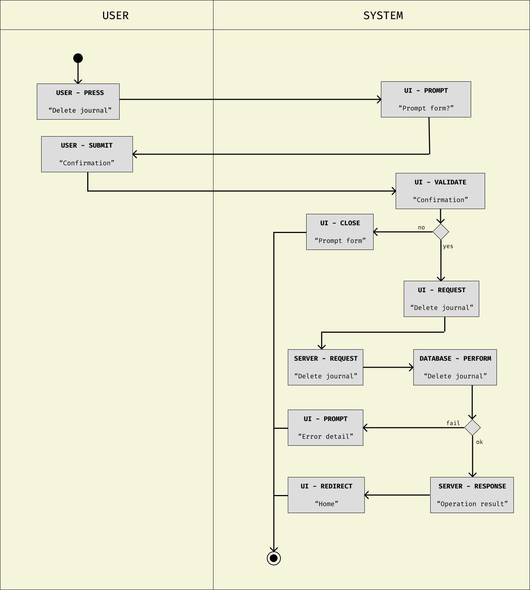
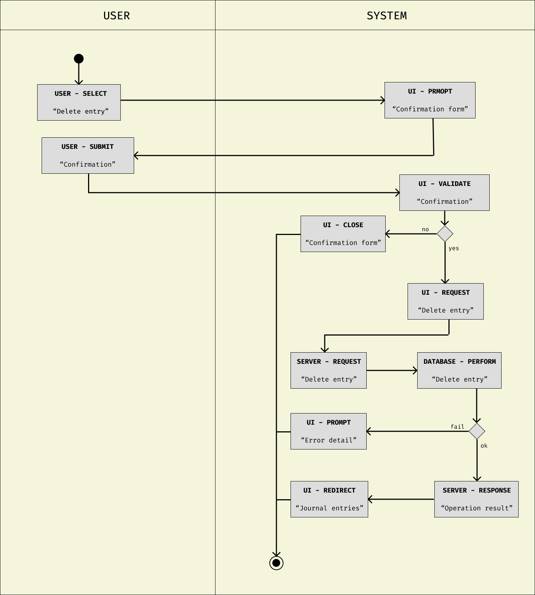
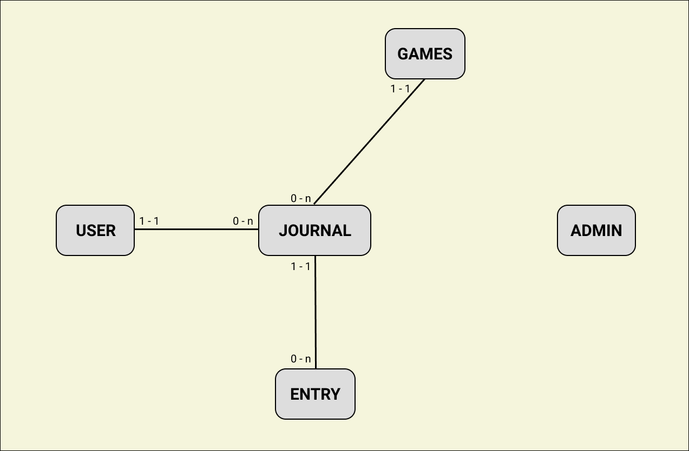
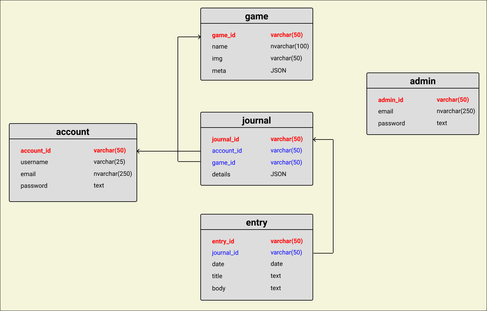

# DESIGN DOCUMENT

## A. Use case

---

### A.1 For user

- Authentication.
  - Sign in.
  - Sign up.
  - Sign out.
  - Password recovery.
- Account interaction.
  - View account detail.
  - Edit account detail.
- Journal operations.
  - Create journal for a game in database.
  - Modify journal detail.
  - Delete journal.
- Entry operations.
  - Add entry.
  - Edit entry.
  - Delete entry.

### A.2 For admin

- Authentication
- CRUD operation on game database.

## B. Activity Diagrams

---

### B.1 Create journal

#### B.2 Update journal

#### B.3 Delete journal

#### B.4 Add entry

#### B.5 Edit entry

#### B.6 Delete entry

## C. Database

---

### C.1 ERD

### C.2 RD

## D. Stack

---

Typical Client-Server model.

- Frontend: NextJS
- Backend: ExpressJS, Postgresql
